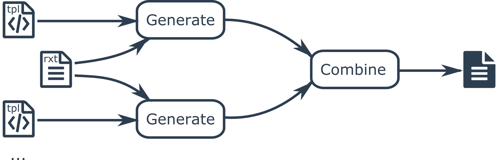

## Principles

A RxTender backend is a python package that contains jinja2 templates. A backend
can implement one, several, or all features of RxTender : Framing,
serialization, and router. Each of these features is implemented as several
template files. The following figure shows how code is generated:

RxTender takes an rxt definition file as input. It then generates chunks of code
from each template file being used. Finally all chunks of code are combined to
generate a final file.

## Backend Structure

python package, jinja2 template engine for code generation.

The source layout of a backend is the following one:

    rtx_backend_foo
        /[language[_framework]]            
            /transport
            /framing
            /serialization
            /observable
                /source
                /sink

where foo is the name of the backend, [language] is the name of a programming
language. There is one [language] module per programmming language supported by
the backend. An optional "framework" name can be provided if different
frameworks of a language are supported and they must generate different code.

All templates follow the same naming convention:

>[output type].[template type].tpl

[output type] is the type of file to generate. All backends implement the
"source" output type. The "source" templates generate source code. If the
selected language also needs other files types to be generated, then additional
output type templates can be implemented. For example with C or C++ a header
file is also needed. So these languages also implement "header" output types. So
a backend with support for c contains "source.content.tpl" and "header.content.tpl"
templates in the serialization modules.

## Messages

- stream creation request
- stream creation ack
- stream creation nack
- stream deletion request
- stream deletion ack
- next item publish
- stream complete
- stream error

## Serialization

- header.tpl
- content.tpl
- footer.tpl

## Streams

Streams generate Observables proxies that follow the [Observable Contract](http://reactivex.io/documentation/contract.html)
