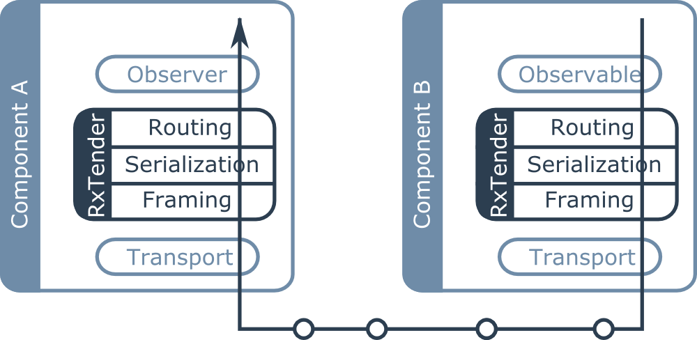

RxTender is built on the following ideas:

- An IDL is used to specify reactive streams.
- There is a clear separation between:
    - transport
    - framing
    - serialization    
    - stream definition
- It is possible to generate source and sink streams.
- It is easy to add support for new programming languages, serialization and framing protocols.
- The transport layer is not managed by RxTenders.

These ideas are summarized on the following figure showing a typical usage of
RxTender where two services communicate with a reactive stream:

